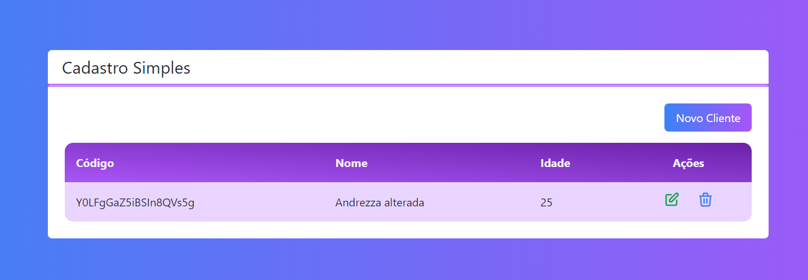
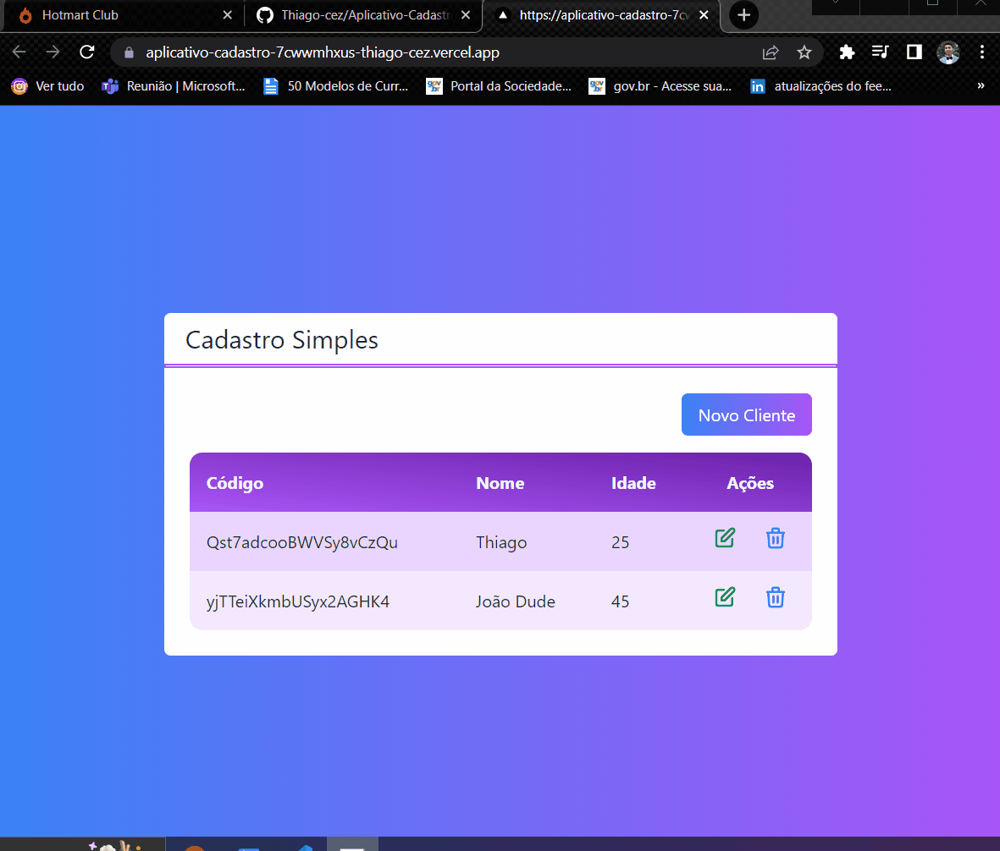

 
    <h1>Aplicativo de Cadastro</h1>

Sistema desenvolvido Para Cadastro e controle de Usuarios, pagina de facil Utilização e interatividade para o Cliente

   <a href="#features">features</a> •
   <a href="#pré-requisitos">pré-requisitos</a> • 
   <a href="#Demonstração do Projeto">Demonstração do Projeto</a> •
   <a href="#rodando-o-app">rodando-o-app</a> •
   <a href="#tecnologias">tecnologias</a> •
   <a href="#autor">autor</a>

---
 

# Demonstração do Projeto

Teste o Projeto Clicando no Botão a seguir<a href="https://aplicativo-cadastro-7cwwmhxus-thiago-cez.vercel.app/">

 

# Gifs 🎥

<h1>
    
    
</h1>

# Features 
- [x] Adicionar Usuarios
- [x] Editar Usuarios
- [x] Remover Usuarios

 

